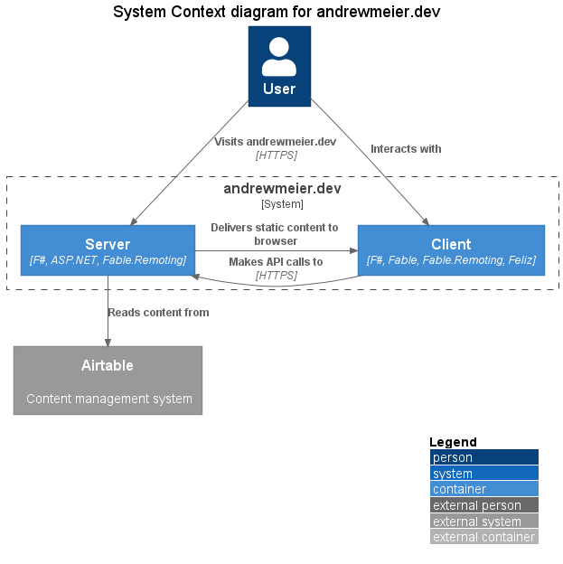

# andrewmeier.dev
Repo for [Andrew's blog](https://andrewmeier.dev).

Built using [F#](https://fsharp.org/), [ASP.NET](https://docs.microsoft.com/en-us/aspnet/core/?view=aspnetcore-5.0),
[Fable](https://fable.io), [Fable.Remoting](https://zaid-ajaj.github.io/Fable.Remoting/),
[Snowpack](https://www.snowpack.dev/), [Tailwind CSS](https://tailwindcss.com/),
[Airtable](https://airtable.com/), and [Pulumi](https://www.pulumi.com/).

## Resources
- [C4 Model](https://c4model.com/): Model for building system diagrams.
- [C4 PlantUML](https://github.com/plantuml-stdlib/C4-PlantUML): PlantUML extentions for C4 Model.