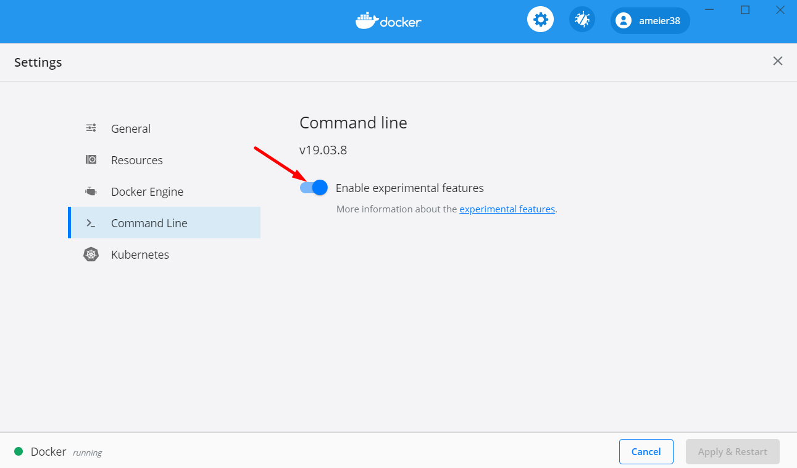

# Pulumi
Infrastructure as code.

## Setup
Set up Kubernetes cluster. See [this post]() for how to
set up personal Raspberry Pi cluster. Get the `kubeconfig`
file and add to the Pulumi project.

```
pulumi config set --secret k8s:kubeconfig <your kubeconfig>
```

Set up a [Cloudflare](https://cloudflare.com) account and navigate to your profile.
Copy the 'Global API Key'.


Add the Cloudflare token to the Pulumi project.

```
pulumi config set --secret cloudflare:apiToken <your cloudflare token>
```

Enabled experimental Docker features.



Set `buildx` as the default build command.
```
docker buildx install
```
> ref: https://docs.docker.com/buildx/working-with-buildx/
