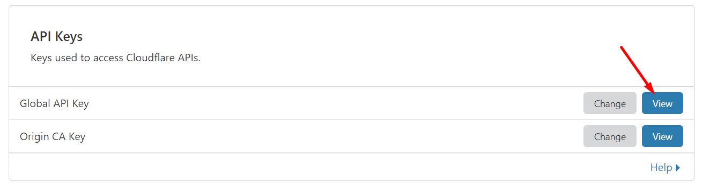
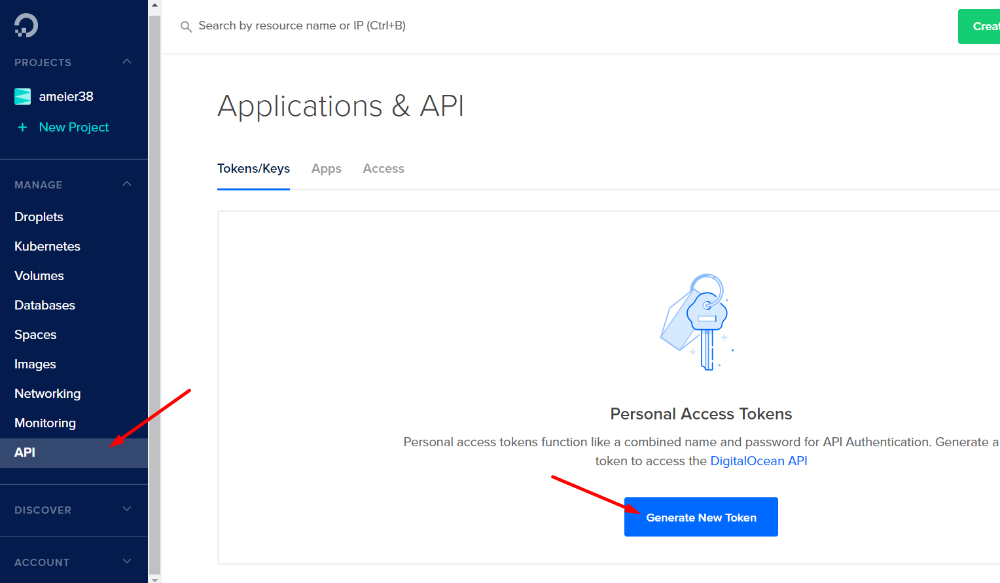

# Pulumi
Infrastructure as code.

## Setup
Buy a domain name. I used [namecheap](https://www.namecheap.com/) to buy `andrewmeier.dev`.

Add the domain to the Pulumi project. Also add your email to use for certificate validation.

```
pulumi config set dns:tld <your domain>
pulumi config set --secret dns:email <your email>
```

Set up Kubernetes cluster. See [this post](https://blog.alexellis.io/test-drive-k3s-on-raspberry-pi/)
for how to set up personal Raspberry Pi cluster. Get the `kubeconfig` file and add to the Pulumi project.

```
pulumi config set --secret k8s:kubeconfig <your kubeconfig>
```

Set up a [Cloudflare](https://cloudflare.com) account and navigate to your profile.
Copy the 'Global API Key'.



Add the Cloudflare token and email to the Pulumi project.

```
pulumi config set --secret cloudflare:apiKey <your cloudflare token>
pulumi config set --secret cloudflare:email <your email>
```

Set up a Docker Hub account. Add your username and password to the Pulumi project.

```
pulumi config set --secret docker:user <your docker user>
pulumi config set --secret docker:password <your docker password>
```

Set up DigitalOcean account. Navigate to Manage/API and create a personal access token.



Add the DigitalOcean token to the Pulumi project.

```
pulumi config set --secret digitalocean:apiKey <your digitalocean token>
```

Create an SSH key (or use existing) and add the public key to the Pulumi project.
```
cat ~/.ssh/id_rsa.pub | pulumi config set --secret ssh:publicKey
```

Create an inlets token and add to the Pulumi project.
```
head -c 16 /dev/urandom | shasum | cut -d" " -f1 | pulumi config set --secret inlets:token
```

## Deployment
First change to the staging Let's Encrypt endpoint.
This is so we don't hit the rate limits if something goes wrong.
```
pulumi config set dns:useStaging true
```

Deploy the workloads.
```
pulumi up
```
```
...
Outputs:
  + blogEndpoint   : "blog-ca4h0w4e:8080"
  + exitNodeIP     : "<exit node ip>"
  + gatewayEndpoint: "traefik:80"
```

Connect to the exit node to inspect the services.
```
ssh root@<exit node ip>
```
> Your ssh public key will be added to the exit node
so be sure to use the corresponding private key to connect.

Check the inlets service.
```
root@exit-node-0396a3e:~# systemctl status inlets
● inlets.service - Inlets Server Service
   Loaded: loaded (/etc/systemd/system/inlets.service; enabled; vendor preset: enabled)
   Active: active (running) since Fri 2020-04-03 11:19:42 UTC; 23min ago
 Main PID: 1163 (inlets)
    Tasks: 4 (limit: 547)
   CGroup: /system.slice/inlets.service
           └─1163 /usr/local/bin/inlets server --port=8080 --token=<your token>
```

Check the caddy service.
```
systemctl status caddy
```
```
root@exit-node-0396a3e:~# systemctl status caddy
● caddy.service - Caddy Web Server
   Loaded: loaded (/etc/systemd/system/caddy.service; enabled; vendor preset: enabled)
   Active: active (running) since Fri 2020-04-03 11:19:42 UTC; 20min ago
     Docs: https://caddyserver.com/docs/
 Main PID: 1155 (caddy)
    Tasks: 6 (limit: 547)
   CGroup: /system.slice/caddy.service
           └─1155 /usr/bin/caddy run --config /etc/caddy/Caddyfile --resume --environ
```
> You may see an error `remote error: tls: bad certificate` which just means that inlets
is trying to connect but cannot since we are using the Let's Encrypt staging endpoint.
You can see the full logs of a service using `journalctl -u <service>`

If both services are running then change to the Let's Encrypt production endpoint.
```
pulumi config set dns:useStaging false
```

Redeploy the workloads.
```
pulumi up
```
