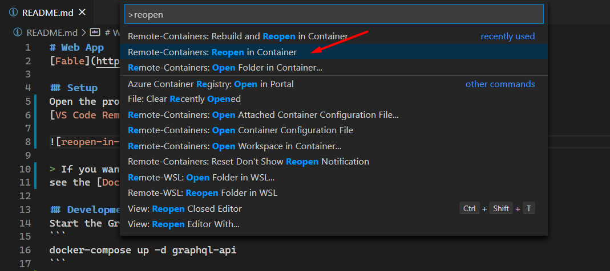

# Web App
[Fable](https://fable.io/docs/) web application for Andrew's blog.

## Setup
Open the project using
[VS Code Remote Containers](https://code.visualstudio.com/docs/remote/containers).



> If you want to develop the application on your local computer then
see the [Dockerfile](./Dockerfile) `base` target for required tooling.

## Development
Start the GraphQL API.
```
docker-compose up -d graphql-api
```
> If using remote containers this should be run from another shell.

Run the development server.
```
fake build -t Serve
```
> Navigate to http://localhost:3000 in your browser. 
Hot-reloading is enabled so making changes will automatically
update the application.

## Resources
- [Fable](https://fable.io/)
- [Feliz](https://zaid-ajaj.github.io/Feliz/)
- [Feliz.MaterialUI](https://github.com/cmeeren/Feliz.MaterialUI)
- [Feliz.Router](https://github.com/Zaid-Ajaj/Feliz.Router)
- [Prism](https://prismjs.com/extending.html#api)
